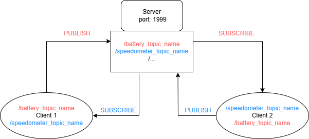
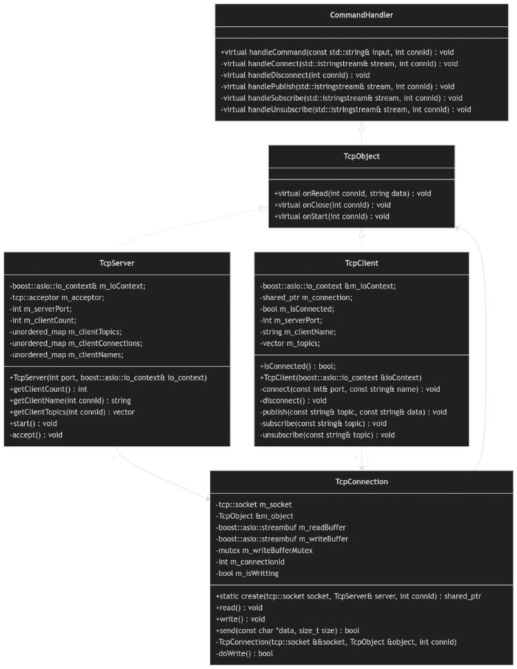

# TCP Server-Client Application

This repository contains a TCP server-client application implemented using Boost.Asio. 
The server can handle multiple clients, and clients can connect, disconnect, subscribe/unsubscribe to topics, and publish messages to topics. 
The repository also includes unit tests using Google Test and Google Mock.



## Features

- TCP server that can handle multiple clients
- Clients can connect and disconnect
- Clients can subscribe/unsubscribe to topics
- Clients can publish messages to topics
- Unit tests using Google Test and Google Mock

## Usage

### Server application

- The server application takes one parameter as input \<port> and does not have runtime commands.

### Client application
- CONNECT \<port> \<client name> - Start a connection to an arbitrary server application
- DISCONNECT – Disconnect from the currently connected server application
- PUBLISH \<topic name> \<data> - Send an arbitrary (ASCII) message to a specific topic
- SUBSCRIBE \<topic name> - Subscribe to a specific topic
- UNSUBSCRIBE \<topic name> - Unsubscribe from a specific topic

## Installation

### Prerequisites

- Docker
- CMake (if building locally)
- Boost (if building locally)
- Google Test (if building locally)

### Adjusting the constants

There is a Constants namespace in the [tcp_connection.hpp](inc/tcp_connection.hpp) file which contains constants which can be adjusted. The constants are:

- delimiter - character used for TCP message delimitation (default: ";")
- max_length - maximum length of TCP message (default: 1024)
- max_clients - maximum number of simultaneous TCP clients connected to one TCP server (default: 32)

### Building the Docker Image

To build the Docker image, run the following command:

```sh
docker build -t tcp_app .
```

### Running the Server and Client

To run the server and client using Docker, use the following commands:

```sh
# Run the server on port 1999
# The option "--network host" runs the container on the host network. It is needed because running two (or more) "docker run" 
# commands runs seperate docker instances which cannot communicate without exposing ports between them through the host
docker run -it --network host --rm tcp_app build/tcp_server 1999

# Run the client
docker run -it --network host --rm tcp_app build/tcp_client
```

To exit the application press CTRL+C (server or client) or type "exit" (client).

### Running the Tests

To run the unit tests using Docker, use the following command:

```sh
docker run -it --rm tcp_app build/test/TCP-Server-Client-Test
```

## Directory Structure

```
├── inc
│   ├── command_handler.hpp
│   ├── tcp_client.hpp
│   ├── tcp_connection.hpp
│   ├── tcp_server.hpp
├── src
│   ├── tcp_client.cpp
│   ├── tcp_connection.cpp
│   ├── tcp_server.cpp
├── test
│   ├── CMakeLists.txt
│   ├── tests.cpp
│   ├── mock_tcp_client.hpp
├── CMakeLists.txt
├── Dockerfile
└── README.md
```

## Building and Running Locally

If you prefer to build and run the application locally without Docker, follow these steps:

### Prerequisites

- CMake
- Boost.Asio
- Google Test and Google Mock

### Building the Application

1. Install dependencies:
    ```sh
    sudo apt-get install libboost-dev
    sudo apt-get install libgtest-dev
    ```

2. Run CMake to configure the project:

    ```sh
    cmake ..
    ```

3. Build the project:

    ```sh
    cmake -S . -B build
    cmake --build build
    ```

### Running the Server and Client

1. Run the server:

    ```sh
    ./build/tcp_server 1999
    ```

2. Run the client:

    ```sh
    ./build/tcp_client
    ```

### Running the Tests

To run the unit tests, use the following command:

```sh
./build/test/TCP-Server-Client-Test
```

## Class Diagram
This picture shows a class diagram of the implementation. A higher resolution version is available: [UML](doc/UML.png).



## License

This project is licensed under the MIT License.